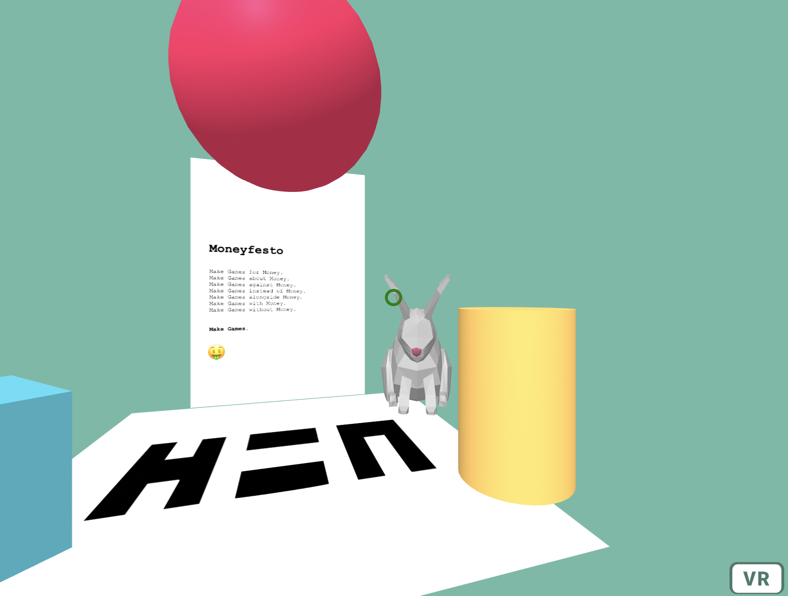

# H=N VR Experiments Playground 

## Iteration 2: Display your wallet balance in VR

Click on the yellow cylinder and it will connect to your wallet.
Click on the rabbit and it will tell your balance.    
Click on the manifesto and it will open it's OBJKT page from where you can collect it.    

Built with [A-Frame](https://aframe.io/) and [Taquito](https://tezostaquito.io).

Prerequisites: [node.js/npm](https://nodejs.org/)

Download or clone this repo. 

To install, run: `npm install` in the main folder

DO NOT upgrade Taquito or the code will break. The Beacon Wallet code is a mess 
https://github.com/ecadlabs/taquito/issues/882, https://github.com/airgap-it/beacon-sdk/issues/138 therefore downgrading the `taquito` / `beacon-wallet` packages for this to run. 

This is experimental code, do not use it for anytthing serious. 

Please make sure you are informed about the conditions of the MIT license for this code, which excludes warranty of any kind. 

DO NOT upgrade the (deprecated) parcel bundler, newer versions have problems with static files such as 3d model formats. DO NOT downgrade either. The working configuration is "parcel-bundler": "1.12.5" and "parcel-plugin-static-files-copy": "2.6.0".

To start, run: `npm run watch`, then open http://localhost:1234 in the browser.

rabbit model: Copyright (c) platyperson, sketchfab.com, [CC BY 4.0](http://creativecommons.org/licenses/by/4.0/)
